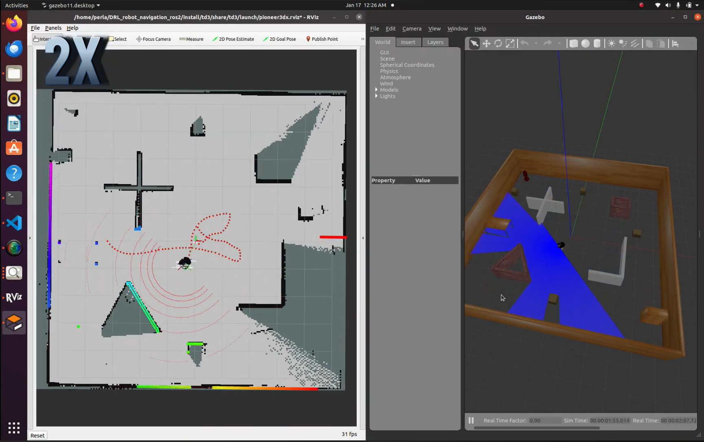
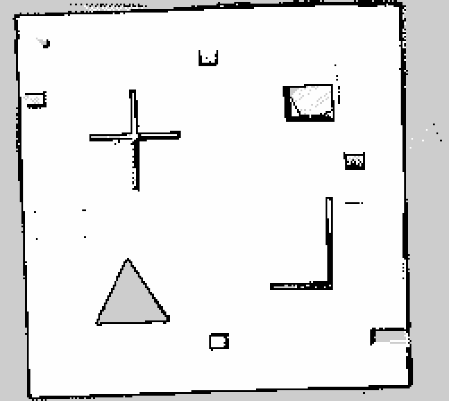
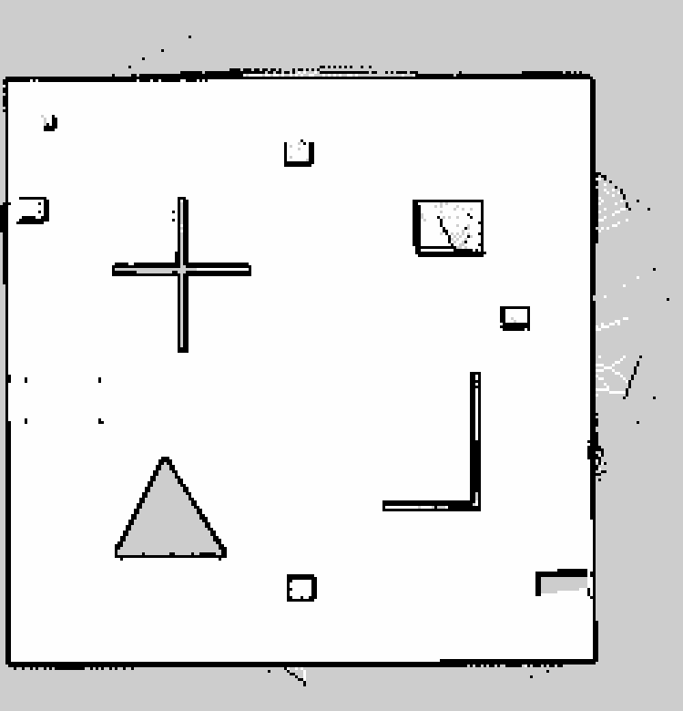
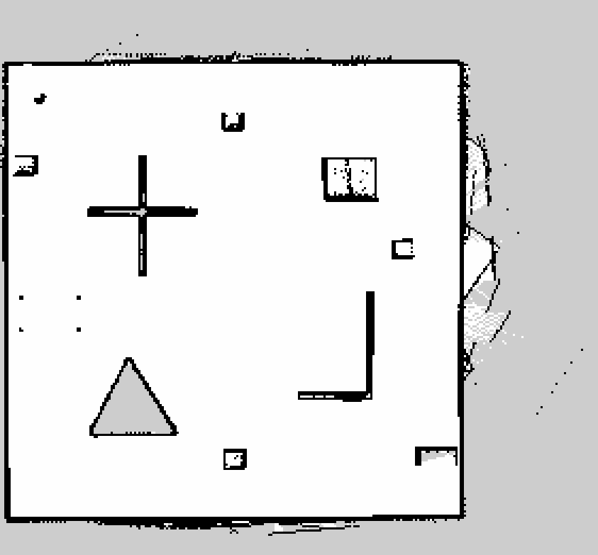
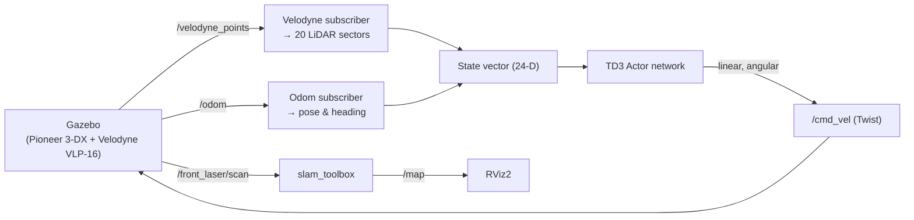
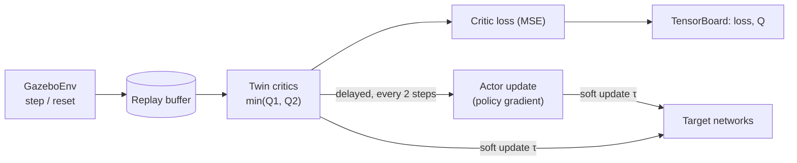

<div align="center">

# DRL Robot Navigation in ROS 2

### Goal-driven autonomous exploration & collision avoidance for a mobile robot, powered by Deep Reinforcement Learning (TD3)

A **Twin-Delayed DDPG (TD3)** agent drives a Pioneer 3-DX robot through an unknown, cluttered room in **ROS 2 + Gazebo** — reaching randomly spawned goals while avoiding obstacles from raw 3D LiDAR, and building a live **SLAM map** of the room as it explores.

[](https://docs.ros.org/en/foxy/)
[](https://releases.ubuntu.com/20.04/)
[](https://www.python.org/)
[](https://pytorch.org/)
[](https://classic.gazebosim.org/)
[](https://arxiv.org/abs/1802.09477)
[](LICENSE)

[**▶ Watch the demo**](https://www.youtube.com/watch?v=IRASuKMiOvw) &nbsp;·&nbsp; [**📄 Read the paper**](https://www.researchgate.net/publication/380875371_Controlling_a_Mobile_Robot_Using_ROS2_and_Machine_Learning) &nbsp;·&nbsp; [**🚀 Quick start**](#-quick-start)

<br/>

<a href="https://www.youtube.com/watch?v=IRASuKMiOvw">
  
</a>

<sub><i><b>Left:</b> the occupancy-grid map built live in RViz as the agent explores &nbsp;·&nbsp; <b>Right:</b> the Gazebo simulation with the robot, obstacles, and laser scan. Click to watch the full demo on YouTube.</i></sub>

</div>

---

## Table of contents

- [Overview](#overview)
- [Highlights](#highlights)
- [Demo & results](#demo--results)
- [How it works](#how-it-works)
- [System architecture](#system-architecture)
- [Repository layout](#repository-layout)
- [Prerequisites](#prerequisites)
- [Installation & build](#installation--build)
- [🚀 Quick start](#-quick-start)
- [Usage](#usage)
- [Hyperparameters](#hyperparameters)
- [Known issues & limitations](#known-issues--limitations)
- [Roadmap](#roadmap)
- [Learning resources](#learning-resources)
- [Acknowledgements](#acknowledgements)
- [Citation](#citation)
- [Authors](#authors)
- [License](#license)

---

## Overview

This project applies **Deep Reinforcement Learning (DRL)** to control a mobile robot in the **Robot Operating System 2 (ROS 2)**, with the goal of autonomously exploring and mapping an unknown room while avoiding collisions.

A neural-network policy is trained end-to-end with the **Twin-Delayed Deep Deterministic Policy Gradient (TD3)** algorithm. The robot perceives its surroundings through a simulated **Velodyne VLP-16** 3D LiDAR, receives its pose from odometry, and learns to output continuous velocity commands that carry it to a goal point without hitting obstacles. On top of the navigation policy, the robot runs online **SLAM (`slam_toolbox`)** so the room is mapped in real time as the agent drives around — turning a goal-reaching policy into an autonomous-exploration system.

The work was carried out as an **Integrator Project** at **GIPSA-Lab, Grenoble INP / Université Grenoble Alpes (2024)** and is documented in the paper *[Controlling a Mobile Robot Using ROS2 and Machine Learning](https://www.researchgate.net/publication/380875371_Controlling_a_Mobile_Robot_Using_ROS2_and_Machine_Learning)*. It ports the ROS 1 [`reiniscimurs/DRL-robot-navigation`](https://github.com/reiniscimurs/DRL-robot-navigation) project to **ROS 2 Foxy** and adds live map generation during exploration.

> [!NOTE]
> **Simulation only.** Everything runs in Gazebo — no physical robot is required. The repository ships a **pre-trained policy** so you can watch the agent navigate and map without training from scratch.

## Highlights

- 🧠 **Continuous-control DRL** — a TD3 actor–critic agent with twin critics, delayed policy updates, and target-policy smoothing for stable learning.
- 🤖 **Learns straight from LiDAR** — a 24-dimensional state (20 LiDAR sectors + goal geometry + last action) maps to continuous linear/angular velocity; no hand-tuned motion planner in the loop.
- 🗺️ **Live SLAM mapping** — `slam_toolbox` builds an occupancy grid of the room *while* the agent explores, so exploration produces a usable map.
- 🎯 **Goal-driven exploration** — goals are continuously re-sampled in free space, keeping the robot moving toward unmapped regions.
- 🎁 **Pre-trained model included** — run the trained agent in one command; optionally retrain from scratch.
- 📊 **TensorBoard logging** — loss and Q-value curves are written during training for easy monitoring.
- 🧩 **Clean ROS 2 packages** — Gazebo world, Pioneer 3-DX + Velodyne robot description, launch files, and RViz config, all `colcon`-buildable.

## Demo & results

**▶ Video:** [Collision avoidance & mapping of the trained agent](https://www.youtube.com/watch?v=IRASuKMiOvw)

Occupancy grids built by the agent with `slam_toolbox` during autonomous exploration (black = walls/obstacles, white = free space, grey = unexplored):

<div align="center">

| Early exploration | Room taking shape | Full room mapped |
|:---:|:---:|:---:|
|  |  |  |

</div>

The raw `.pgm` / `.yaml` map outputs live in [`maps/`](maps/).

## How it works

The navigation task is framed as a **Markov Decision Process** and solved with TD3, a state-of-the-art off-policy algorithm for continuous action spaces.

### State — `24` values

| Component | Size | Description |
|---|:---:|---|
| LiDAR sectors | 20 | The Velodyne point cloud is collapsed into 20 angular bins spanning the 180° in front of the robot; each bin holds the **minimum obstacle distance** in that sector. |
| Distance to goal | 1 | Euclidean distance from the robot to the current goal. |
| Heading error `θ` | 1 | Relative angle between the robot's heading and the direction to the goal. |
| Previous action | 2 | Last commanded linear and angular velocity. |

### Action — `2` values (continuous)

| Action | Network output | Sent to robot |
|---|:---:|---|
| Linear velocity | `a₀ ∈ [-1, 1]` (tanh) | remapped to `(a₀ + 1) / 2 ∈ [0, 1]` m/s (forward only) |
| Angular velocity | `a₁ ∈ [-1, 1]` (tanh) | `a₁` rad/s |

Commands are published to `/cmd_vel` as a `geometry_msgs/Twist`.

### Reward

```text
reward = +100                                     if goal reached      (distance < 0.30 m)
reward = -100                                     if collision         (min LiDAR < 0.35 m)
reward =  v/2 - |ω|/2 - r3(min_laser)/2           otherwise
         where r3(x) = 1 - x if x < 1 else 0
```

The shaped term rewards driving forward, penalizes spinning, and pushes the robot away from nearby obstacles.

### Networks

- **Actor:** `state(24) → 800 → 600 → action(2)`, ReLU hidden layers, `tanh` output.
- **Critic (twin):** two independent `Q(state, action)` heads, each `→ 800 → 600 → 1`; the minimum of the two targets is used to fight overestimation bias.

During training the agent adds decaying exploration noise, stores transitions in a replay buffer, and periodically evaluates the greedy policy. Randomized cardboard boxes and goal positions on every reset keep the training environment diverse.

## System architecture

**Inference / control loop (per step):**



**Training loop:**



## Repository layout

```
DRL_robot_navigation_ros2/
├── README.md
├── LICENSE
├── CITATION.cff
├── requirements.txt
├── docs/
│   └── images/                     # rendered map previews for the docs
├── maps/                           # saved SLAM occupancy grids (.pgm/.yaml)
└── src/
    ├── td3/                        # main package: RL agent, robot, world, launch
    │   ├── scripts/
    │   │   ├── train_velodyne_node.py   # TD3 training node
    │   │   ├── test_velodyne_node.py    # run trained policy (single-goal)
    │   │   ├── map_velodyne_node.py      # run trained policy + continuous exploration for mapping
    │   │   ├── replay_buffer.py
    │   │   ├── point_cloud2.py
    │   │   ├── pytorch_models/           # pre-trained actor/critic weights (.pth)
    │   │   └── results/                  # evaluation curves (.npy)
    │   ├── launch/
    │   │   ├── training_simulation.launch.py
    │   │   ├── test_simulation.launch.py
    │   │   ├── testmap_simulation.launch.py   # trained agent + SLAM mapping
    │   │   ├── robot_state_publisher.launch.py
    │   │   └── multi_robot_scenario.launch.py
    │   ├── models/                  # Gazebo model for the Pioneer 3-DX + Velodyne
    │   ├── urdf/                    # robot URDF + slam_toolbox params
    │   └── worlds/td3.world         # simulated room with obstacles
    ├── velodyne_simulator/         # Velodyne VLP-16 Gazebo plugin (Dataspeed Inc., BSD)
    └── omni_cartographer/          # Cartographer config (not used; SLAM uses slam_toolbox)
```

## Prerequisites

This project targets **Ubuntu 20.04 + ROS 2 Foxy** (the combination used in the paper).

| Dependency | Notes |
|---|---|
| [ROS 2 Foxy](https://docs.ros.org/en/foxy/Installation.html) | Desktop install |
| [Gazebo 11](https://classic.gazebosim.org/) + `gazebo_ros_pkgs` | `sudo apt install ros-foxy-gazebo-ros-pkgs` |
| [`slam_toolbox`](https://github.com/SteveMacenski/slam_toolbox) | `sudo apt install ros-foxy-slam-toolbox` |
| `rviz2` | `sudo apt install ros-foxy-rviz2` |
| Python 3.8 | Ships with Ubuntu 20.04 |
| PyTorch, NumPy, TensorBoard, Matplotlib, squaternion | see [`requirements.txt`](requirements.txt) |

Install the Python dependencies with:

```bash
pip install -r requirements.txt
```

## Installation & build

Clone into your **home directory** (`~`). The scripts load the trained model from a path relative to `~`, so this location matters — see the note in [Quick start](#-quick-start).

```bash
cd ~
git clone https://github.com/MickyasTA/DRL_robot_navigation_ros2.git
cd ~/DRL_robot_navigation_ros2

# Build the workspace (from the repo root, not inside src/)
colcon build --symlink-install

# Source the overlay (add this line to ~/.bashrc to make it permanent)
source ~/DRL_robot_navigation_ros2/install/setup.bash
```

> [!TIP]
> If you change branches or hit a stale build, remove the `build/`, `install/`, and `log/` folders and run `colcon build --symlink-install` again.

## 🚀 Quick start

**1. Run the pre-trained agent** in Gazebo + RViz:

```bash
# Run from your HOME directory so the relative model path resolves correctly
cd ~
ros2 launch td3 testmap_simulation.launch.py
```

This launches Gazebo (server + client), the trained policy node, `robot_state_publisher`, and RViz2. The robot immediately starts driving toward continuously re-sampled goals while avoiding obstacles.

**2. Build the map** — in a second terminal, start `slam_toolbox` with the provided parameters so an occupancy grid is generated live as the robot explores:

```bash
source ~/DRL_robot_navigation_ros2/install/setup.bash
ros2 launch slam_toolbox online_async_launch.py \
  use_sim_time:=true \
  slam_params_file:=$HOME/DRL_robot_navigation_ros2/src/td3/urdf/mapper_params_online_async.yaml
```

The map fills in inside RViz. When the room is mapped, [save it](#usage).

> [!IMPORTANT]
> The policy is loaded from the **hard-coded relative path** `./DRL_robot_navigation_ros2/src/td3/scripts/pytorch_models`. Launch the command from your home directory (`~`) with the repo cloned as `~/DRL_robot_navigation_ros2`, otherwise the model file won't be found.

> [!NOTE]
> The `td3` launch files start the simulation, the policy, and RViz but **do not** start `slam_toolbox` themselves — run it separately as shown in step 2. The robot publishes a 2D laser scan on `/front_laser/scan`, which is the topic the SLAM parameters ([`mapper_params_online_async.yaml`](src/td3/urdf/mapper_params_online_async.yaml)) consume.

## Usage

| Goal | Command | What it does |
|---|---|---|
| **Explore + map** (pre-trained) | `ros2 launch td3 testmap_simulation.launch.py` | Trained agent continuously re-targets goals to explore. Start `slam_toolbox` alongside it (see [Quick start](#-quick-start), step 2) to build the map. |
| **Test** (pre-trained) | `ros2 launch td3 test_simulation.launch.py` | Trained agent drives to a single goal per episode. |
| **Train from scratch** | `ros2 launch td3 training_simulation.launch.py` | Trains a fresh TD3 policy in the randomized environment. |

**Saving a map** once the room is explored:

```bash
ros2 run nav2_map_server map_saver_cli -f ~/my_map
```

**Monitoring training** with TensorBoard:

```bash
tensorboard --logdir ~/DRL_robot_navigation_ros2/src/td3/scripts/runs
```

## Hyperparameters

Defaults used for training (see [`train_velodyne_node.py`](src/td3/scripts/train_velodyne_node.py)):

| Parameter | Value | Parameter | Value |
|---|:---:|---|:---:|
| Max timesteps | 5 × 10⁶ | Batch size | 40 |
| Discount `γ` | 0.99999 | Replay buffer | 1 × 10⁶ |
| Soft update `τ` | 0.005 | Policy noise | 0.2 |
| Noise clip | 0.5 | Policy update freq. | every 2 steps |
| Exploration noise | 1.0 → 0.1 over 5 × 10⁵ steps | Max steps / episode | 500 |
| Eval frequency | 5 × 10³ steps | Eval episodes | 10 |
| Goal-reached distance | 0.30 m | Collision distance | 0.35 m |

## Known issues & limitations

Reported honestly from the project's own findings:

- **Boxes did not reposition between training iterations.** The cardboard boxes were expected to be scattered on each reset to randomize training, but did not move in the ROS 2 / newer-Gazebo port — likely a consequence of the ROS 1 → ROS 2 migration. This hurt training quality, so **the pre-trained policy from the upstream ROS 1 project is shipped and used** for the demo.
- **Unstable training.** The average Q-value sometimes decreased (the agent stopped improving), and full training takes ~8–10 hours per run; converging a policy from scratch needs more time than the project allowed.
- **`omni_cartographer` is unused.** Mapping is done with `slam_toolbox`, not Cartographer; the Cartographer config is kept for reference only.
- **Hard-coded paths.** Several scripts reference `./DRL_robot_navigation_ros2/...` relative to the home directory (see [Quick start](#-quick-start)).

## Roadmap

Ideas for anyone continuing the work:

- [ ] Fix the box-randomization / physics issue in Gazebo and successfully **retrain** the policy in ROS 2.
- [ ] Add a **global exploration strategy** that samples goals toward *unmapped* regions, so the room is explored (and mapped) faster.
- [ ] Port the training to a **TurtleBot** and validate on **real hardware** (e.g., in the GIPSA-Lab).
- [ ] Package Python dependencies and paths so the workspace runs from any location.

## Learning resources

Tutorials the team followed to build this project:

- **ROS 2 basics** — [ROS 2 tutorials (video search)](https://www.youtube.com/results?search_query=ros2+humble+tutorial)
- **Navigation with Nav2** — [Nav2 navigation walkthrough](https://www.youtube.com/watch?v=idQb2pB-h2Q)
- **Reinforcement learning (Q-learning & DQN)** — [RL playlist](https://www.youtube.com/playlist?list=PLZbbT5o_s2xoWNVdDudn51XM8lOuZ_Njv)
- **DDPG & TD3** — [DDPG/TD3 explainer 1](https://www.youtube.com/watch?v=_pbd6TCjmaw) · [explainer 2](https://www.youtube.com/watch?v=0D6a0a1HTtc)
- **Source of the ROS 2 port (with training walkthrough)** — [robotmania video](https://www.youtube.com/watch?v=KEObIB7RbH0)

## Acknowledgements

This project stands on excellent open-source work:

- **[reiniscimurs/DRL-robot-navigation](https://github.com/reiniscimurs/DRL-robot-navigation)** — the original ROS 1 TD3 navigation project and pre-trained model this port is based on.
- **[robotmania](https://www.youtube.com/watch?v=KEObIB7RbH0)** — ROS 2 conversion of the source files and training walkthrough.
- **[velodyne_simulator](https://bitbucket.org/DataspeedInc/velodyne_simulator)** — Velodyne VLP-16 Gazebo plugin © Dataspeed Inc. (BSD License).
- **[slam_toolbox](https://github.com/SteveMacenski/slam_toolbox)** — online SLAM used for live mapping.
- Replay buffer adapted from Patrick Emami's implementation.

## Citation

If you use this work, please cite the project paper:

```bibtex
@techreport{abuali2024controlling,
  title       = {Controlling a Mobile Robot Using ROS2 and Machine Learning},
  author      = {Abuali, Saleh and Sammour, Perla and Asfaw, Mickyas Tamiru and Robu, Bogdan and Hably, Ahmad},
  institution = {GIPSA-Lab, Grenoble INP / Universit\'e Grenoble Alpes},
  type        = {Integrator Project Final Report},
  year        = {2024},
  note        = {Available on ResearchGate},
  url         = {https://www.researchgate.net/publication/380875371_Controlling_a_Mobile_Robot_Using_ROS2_and_Machine_Learning}
}
```

And the foundational algorithm/system it builds on:

```bibtex
@article{cimurs2022goal,
  title   = {Goal-Driven Autonomous Exploration Through Deep Reinforcement Learning},
  author  = {Cimurs, Reinis and Suh, Il Hong and Lee, Jin Han},
  journal = {IEEE Robotics and Automation Letters},
  volume  = {7},
  number  = {2},
  pages   = {730--737},
  year    = {2022},
  doi     = {10.1109/LRA.2021.3133591}
}
```

## Authors

Developed as an Integrator Project at **GIPSA-Lab, Grenoble INP / Université Grenoble Alpes (2024)** by:

**Saleh Abuali · Perla Sammour · [Mickyas Tamiru Asfaw](https://github.com/MickyasTA)**

Supervised by **Bogdan Robu** and **Ahmad Hably**.

## License

Released under the [MIT License](LICENSE). The repository also vendors third-party components under their own licenses:

- `src/velodyne_simulator/` — BSD License (© Dataspeed Inc.)
- `src/omni_cartographer/` — Apache License 2.0 (© ROBOTIS, from the TurtleBot3 project; included for reference and not used at runtime)

See those directories and [LICENSE](LICENSE) for details.
